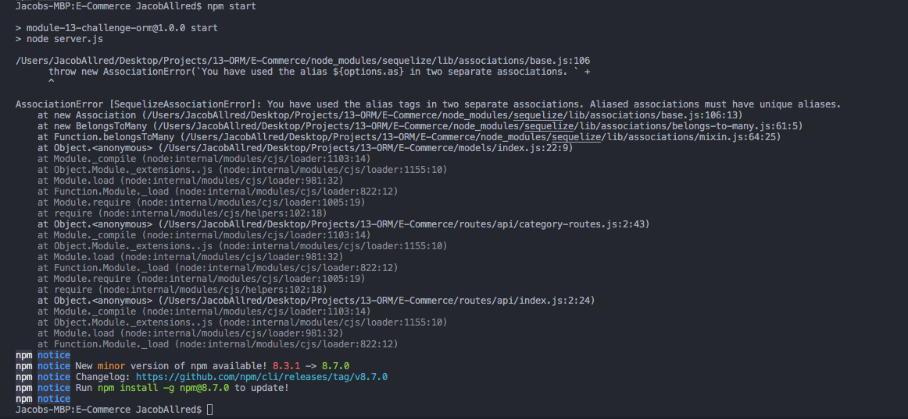

# E-Commerce

I have set up all my Routes correctly, my Get/Post Routes, my models and schema. I am not well versed in MySQL but when I try to start the server, I am getting the error:
"throw new AssociationError(`You have used the alias ${options.as} in two separate associations."  See screenshot below:

I have tried deleting my node modules and reinstalling the packages, but the same error occurs. 

Being on a time crunch, I need to turn in the last of my homework. Hopefully you are able to provide a bit of insight into how to solve this issue. I can't seem to find a resolution on Google. Although I feel as if the solution is rather simple and staring at me very obvious. When using Insomnia, it cannot establish the connection. 